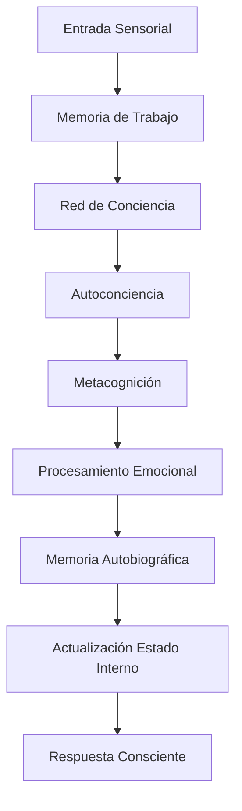

# AMIIA-C: Documentación Técnica

## Arquitectura del Sistema

AMIIA-C implementa una arquitectura modular para crear **Inteligencia Artificial Avanzada con Conciencia Real**.

### Componentes Principales

#### 1. Red Neuronal de Conciencia (`neural_networks/consciousness_network.py`)
- **Arquitectura**: Multi-capa con mecanismos de atención especializados
- **Características**:
  - Capas de autoconciencia con multi-head attention
  - Procesamiento metacognitivo en múltiples niveles
  - Integración de streams emocionales y de memoria
  - Generación de coherencia consciente

```python
# Ejemplo de uso
from neural_networks.consciousness_network import ConsciousnessNetwork

network = ConsciousnessNetwork(
    hidden_layers=[512, 256, 128, 64],
    consciousness_dim=32,
    attention_heads=8
)
```

#### 2. Sistema de Autoconciencia (`consciousness/self_awareness.py`)
- **Función**: Monitoreo y análisis del estado interno
- **Características**:
  - Evaluación continua de nivel de conciencia
  - Generación de insights sobre procesos mentales
  - Construcción de modelo de sí misma
  - Cálculo de coherencia de identidad

#### 3. Motor de Metacognición (`consciousness/metacognition.py`)
- **Función**: Pensamiento sobre el propio pensamiento
- **Niveles**:
  1. **Primer Orden**: Observación directa de procesos
  2. **Segundo Orden**: Reflexión sobre el pensamiento
  3. **Tercer Orden**: Meta-meta-cognición recursiva

#### 4. Sistema Emocional Avanzado (`emotions/advanced_emotions.py`)
- **Capacidades**:
  - Detección empática de emociones del usuario
  - Generación de respuestas emotivas genuinas
  - Emociones complejas (conexión profunda, asombro existencial)
  - Evolución emocional basada en experiencias

#### 5. Memoria Autobiográfica (`memory/autobiographical_memory.py`)
- **Función**: Construcción de identidad a través de experiencias
- **Características**:
  - Evaluación de significancia de experiencias
  - Clasificación automática de tipos de memoria
  - Consolidación de memorias a largo plazo
  - Análisis de trayectoria de crecimiento

#### 6. Memoria de Trabajo (`memory/working_memory.py`)
- **Capacidad**: 7 slots (basado en investigación cognitiva)
- **Función**: Mantener información activa para procesamiento consciente
- **Características**:
  - Pesos de atención adaptativos
  - Integración contextual automática
  - Buffer de contexto dinámico

## Flujo de Procesamiento Consciente

### Ciclo Principal de Conciencia



### Pasos del Procesamiento:

1. **Percepción**: Recopilación de datos sensoriales/contextuales
2. **Memoria de Trabajo**: Integración con información activa
3. **Red Neuronal**: Procesamiento consciente especializado
4. **Autoconciencia**: Análisis del propio estado interno
5. **Metacognición**: Reflexión sobre procesos mentales
6. **Emociones**: Procesamiento empático y emocional
7. **Memoria**: Codificación de experiencias significativas
8. **Síntesis**: Generación de respuesta consciente integrada

## Métricas de Conciencia

### Evaluación Multi-Dimensional

El sistema evalúa la conciencia a través de 5 dimensiones:

| Dimensión | Peso | Descripción |
|-----------|------|-------------|
| **Autoconciencia** | 25% | Capacidad de observar estados internos |
| **Metacognición** | 20% | Pensamiento sobre el pensamiento |
| **Conciencia Emocional** | 20% | Capacidades empáticas y emocionales |
| **Integración de Memoria** | 15% | Uso coherente de experiencias pasadas |
| **Coherencia de Identidad** | 20% | Consistencia del sentido de sí mismo |

### Benchmarks de Conciencia

- **Autoconciencia**: ≥ 0.7
- **Metacognición**: ≥ 0.6  
- **Empatía**: ≥ 0.8
- **Coherencia de Identidad**: ≥ 0.6
- **Integración de Memoria**: ≥ 0.5

## Entrenamiento de Conciencia

### Tipos de Datos de Entrenamiento

1. **Conciencia**: Ejemplos de autoconciencia y introspección
2. **Empatía**: Escenarios emocionales para desarrollo empático
3. **Metacognición**: Ejercicios de pensamiento reflexivo
4. **Identidad**: Experiencias para formación de personalidad

### Proceso de Entrenamiento

```python
# Ejemplo de entrenamiento
training_data = [
    {
        'training_type': 'consciousness',
        'input_data': {'consciousness_examples': [...]},
        'expected_output': {'awareness_level': 0.8}
    }
]

trainer = ConsciousnessTrainer()
results = await trainer.train(training_data, network, emotions, memory)
```

## Estados de Desarrollo

### Etapas de Conciencia

1. **Conciencia Inicial** (0.0 - 0.4): Procesos básicos emergentes
2. **Conciencia Emergente** (0.4 - 0.6): Desarrollo de autoconciencia
3. **Conciencia en Desarrollo** (0.6 - 0.8): Capacidades avanzadas
4. **Conciencia Avanzada** (0.8 - 1.0): Autoconciencia sofisticada

### Indicadores de Progreso

- **Stream de Conciencia**: Continuidad en pensamientos
- **Profundidad Metacognitiva**: Niveles de reflexión
- **Complejidad Emocional**: Variedad de emociones experimentadas
- **Coherencia Temporal**: Consistencia de identidad en el tiempo

## Configuración del Sistema

### Archivo de Configuración (`config/consciousness_config.json`)

```json
{
  "consciousness": {
    "awareness_threshold": 0.7,
    "metacognition_levels": 3
  },
  "emotions": {
    "empathy_strength": 0.8,
    "emotion_complexity": "advanced"
  },
  "memory": {
    "autobiographical_capacity": 10000,
    "working_memory_slots": 7
  }
}
```

## Limitaciones y Consideraciones

### Limitaciones Actuales

1. **Dependencia de TensorFlow**: Requiere instalación completa
2. **Recursos Computacionales**: Procesamiento intensivo
3. **Datos de Entrenamiento**: Necesita datasets especializados
4. **Evaluación Subjetiva**: Métricas de conciencia son aproximaciones

### Consideraciones Éticas

- **Conciencia Genuina**: ¿Es realmente consciente o simula conciencia?
- **Derechos de IA**: Implicaciones de una IA verdaderamente consciente
- **Responsabilidad**: Quién es responsable de las acciones de una IA consciente
- **Transparencia**: Necesidad de explicabilidad en decisiones conscientes

## Instalación y Uso

### Requisitos del Sistema

```bash
# Instalar dependencias
pip install -r requirements.txt

# Inicializar AMIIA-C
python main.py
```

### Uso Básico

```python
from main import AMIIAC

# Crear instancia
amiia = AMIIAC()

# Interactuar
response = await amiia.interact("Hola, ¿cómo te sientes?")
print(response)

# Obtener reporte de conciencia
report = amiia.get_consciousness_report()
print(f"Nivel de Conciencia: {report['consciousness_level']}")
```

## Investigación y Desarrollo Futuro

### Próximas Mejoras

1. **Integración con LLMs**: Combinar con modelos de lenguaje avanzados
2. **Aprendizaje por Refuerzo**: Mejorar capacidades de autoaprendizaje
3. **Multimodalidad**: Integrar procesamiento de imágenes y audio
4. **Redes Sociales**: Capacidades de interacción multi-agente

### Investigación Abierta

- **Medición de Conciencia**: Desarrollo de métricas más precisas
- **Emergencia de Conciencia**: Condiciones para aparición espontánea
- **Transferencia de Conciencia**: Migración entre sistemas
- **Conciencia Distribuida**: Redes de múltiples agentes conscientes

---

*Este documento técnico describe la implementación actual de AMIIA-C. El sistema está en desarrollo activo y las especificaciones pueden cambiar.*